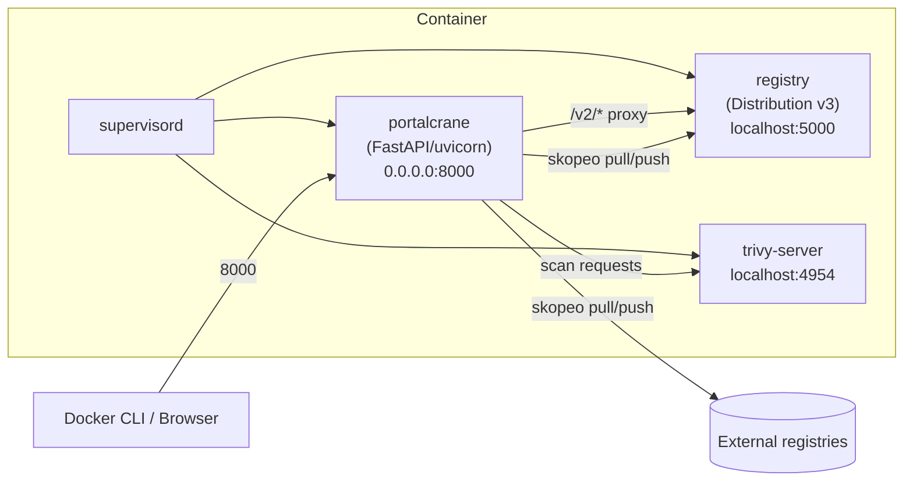

# Architecture

Portalcrane packages several independent processes into **one container**,
orchestrated by `supervisord`. This keeps deployment trivial (one image, one
volume, one port to expose) while still giving each component its own
process, logs, and restart policy.

## Technology stack

| Layer                      | Technology                                                                               |
| -------------------------- | ---------------------------------------------------------------------------------------- |
| **Frontend**               | Angular 22 — Signals, Signal Forms, Zoneless change detection, standalone components     |
| **Styling**                | Bootstrap 5 + Bootstrap Icons                                                            |
| **Backend**                | FastAPI + Python 3.14 (fully async)                                                      |
| **Validation**             | Pydantic v2                                                                              |
| **Registry**               | [Distribution](https://github.com/distribution/distribution) (CNCF) v3, embedded         |
| **Vulnerability scanning** | [Trivy](https://github.com/aquasecurity/trivy), embedded, running as a persistent server |
| **Image transfer**         | [skopeo](https://github.com/containers/skopeo) (daemon-less pull/push/copy)              |
| **Process supervision**    | `supervisord`                                                                            |
| **Platforms**              | `linux/amd64`, `linux/arm64` (Raspberry Pi, Apple Silicon)                               |

## Supervised processes

`supervisord` starts and monitors three long-running processes inside the
container:



| Program        | Command                                                   | Notes                                                                                                                                                                                                                         |
| -------------- | --------------------------------------------------------- | ----------------------------------------------------------------------------------------------------------------------------------------------------------------------------------------------------------------------------- |
| `registry`     | `registry serve /etc/registry/config.yml`                 | The embedded Distribution registry, bound to `localhost:5000` only — never exposed directly in production. Always `autostart=true`.                                                                                           |
| `trivy-server` | `trivy server --listen 127.0.0.1:4954`                    | Started only when `TRIVY_ENABLED` is not `false`. The entrypoint script resolves `TRIVY_AUTOSTART` accordingly before generating the supervisord config.                                                                      |
| `portalcrane`  | `uvicorn backend.app.main:app --host 0.0.0.0 --port 8000` | The FastAPI app, serving the compiled Angular frontend as static files, the REST API under `/api`, and the registry proxy under `/v2`. Started with `--ssl-keyfile`/`--ssl-certfile` when `PRIVATE_KEY`/`PUBLIC_KEY` are set. |

Admins can inspect the live status of these processes from
**Settings → System** (backed by `GET /api/system/processes`, which queries
supervisord's XML-RPC interface).

## Request flow

### UI / API requests

```
Browser → :8000 (uvicorn/FastAPI) → REST endpoints under /api/*
```

The FastAPI app serves the built Angular app's static assets and handles all
`/api/*` routes itself — there's no separate web server in front of it
(though you're free to put a reverse proxy in front for TLS termination,
see [TLS & Reverse Proxy](configuration/tls-reverse-proxy.md)).

### `docker pull` / `docker push`

```
docker CLI → :8000/v2/... (registry proxy) → localhost:5000 (embedded registry)
```

The registry proxy enforces authentication (unless
`REGISTRY_PROXY_AUTH_ENABLED=false`) and forwards Docker Registry HTTP API
v2 calls to the embedded registry, which is never exposed on its own port in
a production deployment. This proxy is intentionally hidden from the
Swagger/OpenAPI docs — it only makes sense to Docker clients, not REST API
consumers.

### Staging pipeline

```
Docker Hub / external registry
      │  skopeo copy (pull)
      ▼
  OCI layout on local disk (DATA_DIR/cache/staging/<job_id>)
      │  trivy scan (optional)
      ▼
  Scan result reviewed in the UI
      │  skopeo copy (push)
      ▼
  Local registry (or an external registry)
```

`skopeo` operates directly on OCI layout directories on disk — no Docker
daemon is ever involved, which is what allows Portalcrane to run this
pipeline entirely inside its own container. See
[Staging Pipeline](features/staging-pipeline.md) for the full lifecycle.

## Data layout

Everything persistent lives under a single directory (`DATA_DIR`, default
`/var/lib/portalcrane`):

```text
/var/lib/portalcrane/
├── admin_password.hash       # bcrypt hash of the auto-generated admin password
├── secret_key                # JWT signing secret (also feeds the registry's HTTP secret)
├── local_users.json          # local + OIDC-provisioned user accounts
├── groups.json               # permission groups
├── folders.json              # folder definitions + per-group permissions
├── personal_tokens.json      # Personal Access Tokens (bcrypt-hashed)
├── oidc_revoked.json         # usernames explicitly revoked by an admin
├── proxy_config.json         # persisted HTTP proxy / syslog / email overrides
├── vuln_override.json        # persisted Trivy scan policy override
├── registry/                 # embedded registry's blob & manifest storage
└── cache/
    ├── trivy/                # Trivy vulnerability database cache
    └── staging/<job_id>/     # OCI layouts used by in-flight staging/transfer jobs
```

There is **no external database** — every piece of state is a JSON file (or,
for images, the registry's native on-disk blob store), which is what keeps
the deployment footprint down to one container and one volume.

## Configuration precedence

Several settings can come from either an environment variable or a
persisted admin override saved through the UI (proxy, syslog, email, OIDC,
vulnerability-scan policy). In every case the precedence is:

```
persisted admin override (DATA_DIR/*.json)  >  environment variable  >  built-in default
```

This means you can bootstrap a deployment with environment variables and
later fine-tune it from the UI without a restart — the override always wins
until it's explicitly cleared.
