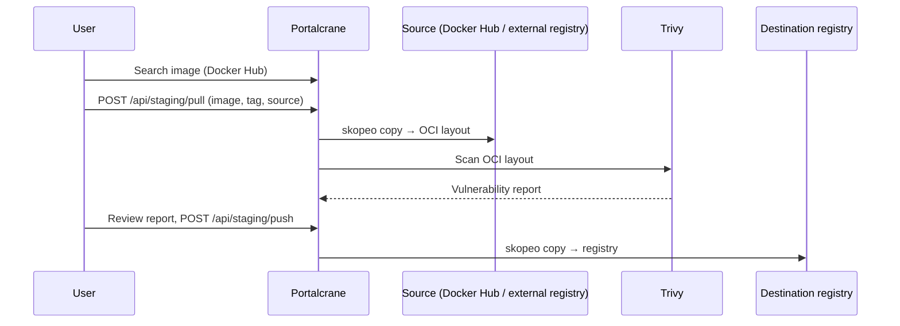

# Staging Pipeline

The Staging page is the recommended way to get images into your registry:
instead of `docker pull` + `docker push` blind, Portalcrane pulls the image
server-side, scans it, and only then lets you decide where it goes.



## 1. Search

`GET /api/staging/search/dockerhub?q=<term>` proxies the public Docker Hub
search API, returning name, description, star/pull counts, and
official/automated flags.

## 2. Pull

```bash
curl -X POST http://<host>:8000/api/staging/pull \
  -H "Authorization: Bearer <token>" -H "Content-Type: application/json" \
  -d '{"image": "library/redis", "tag": "7.2"}'
```

`skopeo` downloads the image as an **OCI layout** under
`DATA_DIR/cache/staging/<job_id>/` — no Docker daemon is involved on the
server. The source is resolved in this order:

1. `source_registry_id` — a **saved** external registry (its stored
   credentials and TLS settings are used automatically).
2. `source_registry_host` (+ optional `source_registry_username`/`password`)
   — an **ad-hoc** registry, not saved anywhere.
3. Neither field set — defaults to **Docker Hub**.

```bash
# Pull from a saved external registry instead of Docker Hub
curl -X POST http://<host>:8000/api/staging/pull \
  -H "Authorization: Bearer <token>" -H "Content-Type: application/json" \
  -d '{
        "image": "myorg/myimage",
        "tag": "1.4.0",
        "source_registry_id": "<registry_id>"
      }'
```

### Permission checks on pull

- Pulling **from the local registry** (i.e. the resolved source host is
  Portalcrane's own registry) requires `can_pull` on the destination
  folder.
- Pulling from a **genuinely external** source (Docker Hub, a saved or
  ad-hoc registry) requires the `can_pull_external` capability on any
  folder the user has it on — see
  [Folder-Based Access Control](folders.md).

## 3. Scan

Once the pull completes, Trivy scans the OCI layout automatically (unless
disabled — see [Vulnerability Scanning](../configuration/vulnerability-scanning.md)).
The job's `scan_result` / `vuln_result` fields populate with grouped
vulnerabilities and CVSS scores. A per-job override can relax or tighten
the policy for this one pull only:

```json
{
  "image": "library/redis",
  "tag": "7.2",
  "vuln_scan_enabled_override": true,
  "vuln_severities_override": ["CRITICAL"]
}
```

## 4. Push

Review the scan result in the UI, then push the staged image to its final
destination — the **local registry** or a **genuinely external** one:

```bash
# Push to the local registry, into the "backend" folder, under a new name/tag
curl -X POST http://<host>:8000/api/staging/push \
  -H "Authorization: Bearer <token>" -H "Content-Type: application/json" \
  -d '{
        "job_id": "<job_id>",
        "target_image": "backend/redis",
        "target_tag": "7.2",
        "folder": "backend"
      }'
```

```bash
# Or push straight to an external registry instead
curl -X POST http://<host>:8000/api/staging/push \
  -H "Authorization: Bearer <token>" -H "Content-Type: application/json" \
  -d '{
        "job_id": "<job_id>",
        "external_registry_id": "<registry_id>",
        "target_image": "myorg/redis",
        "target_tag": "7.2"
      }'
```

When pushing externally, the destination's username replaces the source
namespace in the image path (e.g. `library/redis` staged for user `myorg`
becomes `myorg/redis`), matching how most external registries scope
repository names to an account/organization.

### Permission checks on push

- Pushing **to the local registry** requires `can_push` on the destination
  folder.
- Pushing to a **genuinely external** destination requires
  `can_push_external`.
- Non-admin users can only push (or delete) jobs they **own** — job
  ownership is recorded at pull time.
- If the scan flagged a **blocking severity**, the push is refused
  (`403 Forbidden`) unless the account holds `can_bypass_vuln_block` (or
  `is_admin`) — see
  [Vulnerability-block bypass](users-groups-permissions.md#vulnerability-block-bypass).

!!! warning "External push can't become a backdoor to the local registry"
    If an "external" destination actually resolves to Portalcrane's own
    registry (the hidden `__local__` system entry, or an ad-hoc host that
    happens to point at `localhost:5000`), Portalcrane enforces the
    **local** `can_push` check instead of the external one — otherwise a
    pull-only user could push simply by picking "External → Local
    Registry" in the destination selector.

## Managing jobs

```bash
GET    /api/staging/jobs           # list jobs visible to the caller (admins see all, others see their own)
GET    /api/staging/jobs/{job_id}  # inspect a single job
DELETE /api/staging/jobs/{job_id}  # delete the job record and its OCI layout directory
```

Deleting a job removes its staging directory from disk. Leftover
directories from crashed jobs are cleaned up separately — see
[System Maintenance → Orphan OCI cleanup](system-maintenance.md#orphan-oci-cleanup).

## Staging vs. Transfer

Staging is built for the "one image, reviewed by a human" workflow: search,
pull, scan, decide, push. For bulk or scheduled synchronization between
registries (no interactive review step), use
[Transfers](external-registries.md#transfers) instead — same underlying
pull → scan → push pipeline, but built to move many images in one request.
