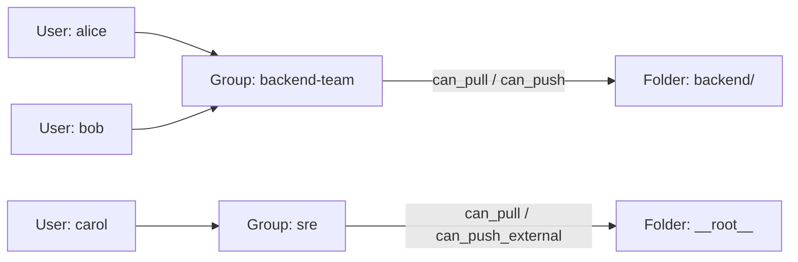

# Users, Groups & Permissions

Portalcrane's permission model has three layers: **accounts** (who can log
in), **groups** (named sets of accounts), and **folders** (where
permissions actually live). Understanding how they connect makes the rest
of the access-control story straightforward.



## Accounts

Two kinds of accounts exist:

- **Built-in admin** — the `admin` account (`ADMIN_USERNAME`). Its password
  is auto-generated and printed in the logs on first launch. It **cannot**
  be deleted, renamed, or demoted through the UI — only its password can be
  changed.
- **Local users** — created via **Settings → Accounts**
  (`POST /api/auth/users`), each with:
  - a username and password (minimum 8 characters),
  - an `is_admin` flag (full access to everything, bypassing folder
    checks entirely),
  - a `disabled` flag (blocks login without deleting the account or its
    group memberships).

OIDC-provisioned accounts (see [Authentication & OIDC](../configuration/authentication.md))
show up in the same list with `auth_source: "oidc"` — they have no local
password and can't have one set through the API.

```bash
curl -X POST http://<host>:8000/api/auth/users \
  -H "Authorization: Bearer <admin-token>" \
  -H "Content-Type: application/json" \
  -d '{"username": "alice", "password": "correct-horse-battery", "is_admin": false}'
```

!!! note "Admins always bypass folder checks"
    An account with `is_admin: true` has unconditional pull/push access to
    every folder and every external registry. Folder permissions only
    matter for non-admin accounts.

## Groups

**Folder permissions are granted to groups, never directly to individual
users.** A group is just a named list of usernames
(`Settings → Groups`, `/api/groups`):

```bash
curl -X POST http://<host>:8000/api/groups \
  -H "Authorization: Bearer <admin-token>" \
  -H "Content-Type: application/json" \
  -d '{"name": "backend-team", "description": "Backend engineers"}'

curl -X PUT http://<host>:8000/api/groups/<group_id>/members \
  -H "Authorization: Bearer <admin-token>" \
  -H "Content-Type: application/json" \
  -d '{"username": "alice"}'
```

A user's **effective access to a folder is the union of the permissions of
every group they belong to** — if `alice` is in both `backend-team`
(push access to `backend/`) and `sre` (pull access to `__root__`), she has
both.

Deleting a group cascades: its permission entries are purged from every
folder it had been granted access to. Removing a user (local or OIDC)
removes them from every group, which is enough to fully revoke their
inherited access without touching folder configuration.

!!! tip "Why groups instead of per-user grants?"
    Modeling permissions on groups means onboarding a new team member is
    "add them to a group," not "recreate five folder grants." It also means
    a folder's permission list stays small and legible even as headcount
    changes.

## Roles at a glance

| Role                   | Granted by                                                                                | Scope                                                                                  |
| ---------------------- | ----------------------------------------------------------------------------------------- | -------------------------------------------------------------------------------------- |
| **Admin**              | `is_admin: true` on the account                                                           | Everything — every folder, every registry, all settings                                |
| **Folder pull/push**   | Group membership + a folder permission grant                                              | Read/write on the **local** registry, scoped to a namespace prefix                     |
| **External pull/push** | Group membership + a folder permission grant with `can_pull_external`/`can_push_external` | Transfers with **external** registries via the Staging/Transfer pages                  |
| **No grant**           | (default)                                                                                 | Denied — a user whose groups have no entry on the matched folder gets no access at all |

The full mechanics of folder matching and the four independent permission
flags are covered in [Folder-Based Access Control](folders.md).

## Personal Access Tokens

Any authenticated account — local or OIDC — can generate its own
[Personal Access Tokens](personal-access-tokens.md) for `docker login` or
API access, without an admin having to issue credentials manually.
